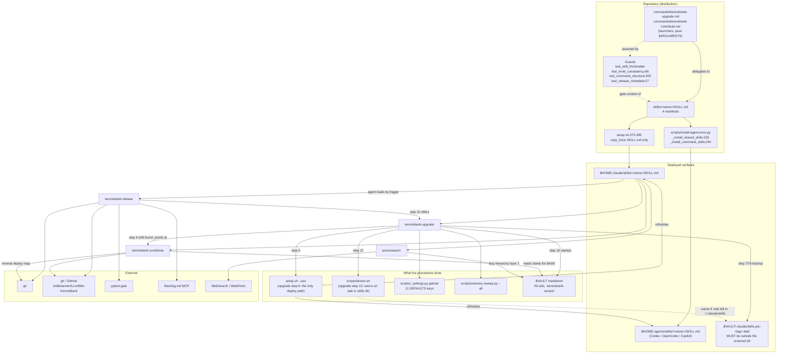

# C4 Code Level — `skills/`

> **Scope note.** `skills/` contains **four files and no code**:
> `autoresearch/SKILL.md`, `kennisbank-contribute/SKILL.md`,
> `kennisbank-release/SKILL.md`, `kennisbank-upgrade/SKILL.md`. There are no
> Python modules, no classes, no functions, and therefore no function
> signatures to document. Nothing was summarized away or silently dropped —
> the directory listing is exhaustive.
>
> There is **no vendored third-party code and no generated artifact** in this
> directory. All four manifests are hand-authored.
>
> Because the C4 "code element" abstraction does not map onto declarative
> markdown, Section 2 documents the **manifest contract** instead: the
> frontmatter (the closest thing to a signature), the invocation surface
> (triggers, arguments, dry-run), and each numbered procedure step with the
> concrete command it shells out to. The Python functions that *operate on*
> this directory live in `setup.sh` and `scripts/install-agent-envs.py`; they
> are given with complete signatures in Section 3, where they belong.

---

## 1. Overview

| Field | Value |
|---|---|
| **Name** | KennisBank agent skills (distribution manifests) |
| **Location** | `skills/` (repo-relative). Deployed to `$HOME/.claude/skills/<name>/SKILL.md` (Claude Code) and `$HOME/.agents/skills/<name>/SKILL.md` (Codex / OpenCode / Copilot). |
| **Language(s)** | Markdown with YAML frontmatter. Bodies embed POSIX `sh`/`bash` fences (executed by the agent via its Bash tool) and reference `python3`, `git`, `gh`, and `mcp__backlog__*` MCP tools. |
| **Purpose** | Encode the four multi-step operator procedures that an agent must not improvise: release the distribution, upgrade a deployed vault, contribute local vault edits back upstream, and run a bounded autonomous research loop. |

**Description.** These are *procedures*, not features. Three of the four
(`kennisbank-release`, `kennisbank-upgrade`, `kennisbank-contribute`) manage the
distribution boundary that defines this repository: the repo is a distribution,
the vault at `$VAULT/.claude/scripts/` is the running copy, and every step in
these manifests exists because moving code across that boundary by hand went
wrong at least once. `kennisbank-release/SKILL.md:14-15` states this explicitly:
"Every step below exists because a manual release got it wrong at least once."
The fourth (`autoresearch`) is unrelated to the distribution; it is a
research-loop skill that reads the vault as a knowledge source.

**Load-bearing property — YAML block scalars are mandatory, not stylistic.**
All four manifests use block scalars for `description`: `>-` on the three
kennisbank skills (`kennisbank-release/SKILL.md:3`,
`kennisbank-upgrade/SKILL.md:3`, `kennisbank-contribute/SKILL.md:3`) and `>` on
`autoresearch/SKILL.md:3`. This is enforced causally, not by convention: all
four descriptions contain the substring `Triggers: `, and
`tests/test_skill_frontmatter.py:53-57` raises
`"plain YAML scalar contains mapping delimiter ': '"` for a *plain* scalar
containing `: `, because — per the parser docstring at
`tests/test_skill_frontmatter.py:14-18` — **Copilot rejects such skill
manifests**. A block scalar (or a quoted scalar, per
`test_quoted_description_allows_colon_space`) is the only way to keep the
trigger phrases in the description field.

---

## 2. Code Elements

### 2.0 The manifest contract (all four files)

| Frontmatter key | Type | Required by | Present in |
|---|---|---|---|
| `name` | plain scalar; **must equal the parent directory name** | `tests/test_skill_frontmatter.py:70` (`fm.get("name") == slug`) | all four |
| `description` | block scalar (`>` / `>-`) | `tests/test_skill_frontmatter.py:71` (non-empty); English-only per `test_all_skill_descriptions_are_english_metadata` (`:96-105`) | all four |
| `allowed-tools` | space-separated tool list (**not** a YAML sequence) | nothing — optional | **only** `autoresearch/SKILL.md:9` |

`autoresearch/SKILL.md:9` reads
`allowed-tools: Read Write Bash WebFetch WebSearch Glob Grep`. The three
kennisbank skills declare no `allowed-tools` and therefore inherit the session's
full tool set — which they need, since they call `git`, `gh`, and
`mcp__backlog__*`.

**Dry-run is a per-skill contract with three different scopes** (do not assume
they are the same):

| Skill | Dry-run semantics | Location |
|---|---|---|
| `kennisbank-release` | prints planned version, changelog section and actions; writes nothing | `:28-29` |
| `kennisbank-upgrade` | performs steps 1–6, prints planned copies and backups; no backup, copy, stamp, or checkout side effect beyond `fetch` | `:163-166` |
| `kennisbank-contribute` | performs steps 1–5, prints branch name and file list; no branch, commit, push, or PR | `:124-126` |
| `autoresearch` | none | — |

---

### 2.1 `skills/kennisbank-release/SKILL.md` — release the distribution (191 lines)

**Role.** End-to-end release of a new KennisBank version: version proposal from
the commit delta, changelog, both READMEs, gate, PR, Copilot review, merge,
verified tag, GitHub release.

**Frontmatter** (`:1-10`): `name: kennisbank-release` (`:2`); `description` (`:3-9`)
block scalar ending in `Triggers: /kennisbank-release, "release kennisbank",
"cut a kennisbank release"`.

**Ground rules** (`:17-29`) — four invariants that gate the whole procedure:

| Rule | Rationale recorded in the manifest | Location |
|---|---|---|
| Never tag a branch tip | a tag placed on the assumption a merge landed points at different code than main contains | `:19-22` |
| Never skip the Copilot review | on v0.20.0 all five comments were correct, one exposing a hole in a guard written in that same PR; comments are *not* visible via `gh pr view` | `:23-26` |
| Fail closed on a red gate | stop and report; never release past a failure | `:27` |
| `--dry-run` writes nothing | — | `:28-29` |

**Procedure.**

| Step | What it does | Concrete invocation | Location |
|---|---|---|---|
| 0 | Refuse to run outside a repo clone; reject dirty **tracked** tree only — untracked build detritus (`.playwright-mcp/`) must not block a release. Confirm `origin` = upstream (Jvdbreemen), `fork` = user's (rvdbreemen); push to `fork`, PR against `origin` | `git remote -v`; `git status --porcelain --untracked-files=no` | `:31-44` (untracked rule `:38-41`, remotes `:43-44`) |
| 0b | Create the backlog task and set it `In Progress` — CLAUDE.md requires a task before execution | `mcp__backlog__task_create` | `:46-50` |
| 1 | Propose the version from the commit delta and ask for confirmation. Classification: only `fix:`/docs → patch; any `feat:`, schema change, dropped table, changed output contract, or new dependency → minor; breaking CLI/command/vault-layout change → major. "Do not propose a major to signal maturity" | `LAST=$(git tag --sort=-v:refname \| grep '^v[0-9]' \| head -1)`; `git log --oneline "$LAST"..HEAD` | `:52-67` (commands `:55-57`, rules `:63-65`, warning `:67`) |
| 2 | Dated `## [X.Y.Z]` Keep-a-Changelog section; repoint `[Unreleased]` compare link and add the new version's link | (edit `CHANGELOG.md`) | `:69-78` |
| 3 | Bump **both** README highlight sections in one edit: `README.md` (`## Feature highlights (vX.Y.Z)`, `### New in vX.Y.Z`) and `README.nl.md` (`## Functie-highlights (vX.Y.Z)`, `### Nieuw in vX.Y.Z`). Cites `e7b014d` as the failure: English-only edit left Dutch stale for weeks | (edit both READMEs) | `:80-88` |
| 4 | Two gate runs answering different questions: full suite **before** steps 2–3 on the code being released; documentation subset **after**. Steps 2 and 3 are one unit — running the subset between them fails the consistency lint by construction | `python3 -m pytest tests -q` (`:97`); then `python3 -m pytest tests/test_release_metadata.py tests/test_docs_consistency.py tests/test_integration_documentation.py tests/test_command_structure.py tests/test_skill_frontmatter.py tests/test_suite_collection.py -q` (`:103-107`) | `:90-116` |
| 5 | Commit, push branch to `fork`, open PR against `origin/main`. Merge method chosen deliberately: merge commit when the branch is one commit per task and individual reverts have value; squash for a series of small commits that are one logical change | `gh pr create` (implied) | `:118-127` |
| 6 | Wait for CI **and** the Copilot review; treat every comment as possibly correct, check it against code or a measurement, fix in a follow-up commit on the same branch, say why for anything left | `gh pr checks <n> --repo Jvdbreemen/LLmWiki-KennisBank --watch` (`:134`); `gh api repos/.../pulls/<n>/comments --jq ...` (`:135-136`); `gh api repos/.../pulls/<n>/reviews --jq ...` (`:137-138`) | `:129-144` |
| 7 | Merge, then **verify** the merge commit is on `origin/main` before continuing | `gh pr merge <n> --repo ... --merge`; `git fetch origin`; `git log --oneline origin/main -3` | `:146-154` |
| 8 | Tag the verified SHA and assert the tag resolves to it | `SHA=$(git rev-parse origin/main)`; `git tag -a vX.Y.Z "$SHA" -m "…"`; `git push origin vX.Y.Z`; `git rev-list -n1 vX.Y.Z` must equal `$SHA` | `:156-163` |
| 9 | Extract the changelog section **with explicit UTF-8 and an absolute path**, publish, and verify the body is non-empty. Both halves exist because both failed: a generator died on cp1252 and `gh` published zero bytes without complaint; then `--notes-file /tmp/...` read a different file than Python wrote, because Python's `/tmp` on Windows is `C:\tmp\` while Git Bash maps it elsewhere | `gh release create vX.Y.Z --repo ... --notes-file "<absolute path>" --verify-tag`; `gh release view vX.Y.Z --json body -q '.body \| length'` | `:165-180` |
| 10 | Set the release task and every task in the release to `Done`, commit, push, then offer `/kennisbank-upgrade` | `mcp__backlog__*`; `/kennisbank-upgrade` | `:182-186` |

**Timing note** (`:188-191`): the suite takes ~20 minutes on a Windows dev
machine and ~2.5 on the Linux CI runner; base timeout margins on the runner
measurement.

---

### 2.2 `skills/kennisbank-upgrade/SKILL.md` — upgrade a deployed vault (166 lines)

**Role.** Move a deployed vault to the latest **release tag** (never bare
`main`, `:13`), backing up drifted local edits first and delegating the actual
deploy to `setup.sh`.

**Frontmatter** (`:1-9`): `name: kennisbank-upgrade` (`:2`); description ends
`Triggers: /kennisbank-upgrade, "upgrade kennisbank", "update kennisbank
tooling"` (`:7-8`).

**Path resolution** (`:15-18`): `VAULT="${KENNISBANK_VAULT:-$HOME/KennisBank}"`
(`:16`) — the ADR-0002 convention, written without a trailing slash so the
guard in Section 3.3 passes; `REPO="${KENNISBANK_REPO}"`, and if empty, ask the
user and confirm with `git -C "$REPO" rev-parse` (`:17-18`).

**Deploy map** (`:20-30`) — reference only; step 9 executes it via `setup.sh`:

| Repo source | Deploy destination |
|---|---|
| `scripts/*.py`, `scripts/*.sh`, `scripts/*.json` | `$VAULT/.claude/scripts/` |
| `templates/*.md` | `$VAULT/04-templates/` |
| `commands/*.md`, `commands/*/*.md` | `$HOME/.claude/commands/` |
| `skills/*/SKILL.md` | `$HOME/.claude/skills/<name>/` |

`CLAUDE.md` is personalized and is **never** overwritten (`:30`).

**Procedure** (`:32-106`).

| Step | What it does | Concrete invocation | Location |
|---|---|---|---|
| 1 | Fetch tags | `git -C "$REPO" fetch --tags --quiet` | `:33` |
| 2 | Resolve latest release tag | `LATEST=$(git -C "$REPO" tag --sort=-v:refname \| grep '^v[0-9]' \| head -1)` | `:34` |
| 3 | Read `INSTALLED` from the `tag` field of `$VAULT/.claude/.kennisbank-version`; absent → treat as unknown/legacy and say so | (read JSON) | `:35-36` |
| 4 | If equal, report "up to date" and stop | — | `:37` |
| 5 | Show the delta, commit log first, CHANGELOG section only if useful | `git -C "$REPO" log --oneline "$INSTALLED..$LATEST"`; `git -C "$REPO" show "$LATEST:CHANGELOG.md"` | `:38-42` |
| 6 | **Drift guard over all four deploy-map categories** — scripts, templates, commands, and skills. For skills iterate the union of installed dirs (`$HOME/.claude/skills/*/SKILL.md`) **and** every `skills/*/` present at LATEST. A skill absent at INSTALLED but already present locally counts as at-risk. Any difference → warn, point at `kennisbank-contribute`, ask whether to proceed | `diff --strip-trailing-cr <(git -C "$REPO" show "$INSTALLED:scripts/<f>") "$VAULT/.claude/scripts/<f>"` (CRLF-agnostic, same pattern per category) | `:43-60` |
| 7 | Back up every drifted category as `.pre-$INSTALLED.bak`: `scripts` → `scripts.pre-$INSTALLED.bak`, `04-templates` → `04-templates.pre-$INSTALLED.bak`, `$HOME/.claude/commands` → `commands.pre-$INSTALLED.bak`, and per skill → `$VAULT/.claude/skills.pre-$INSTALLED.bak/<name>`. **The skill backup must land outside `~/.claude/skills/`** — that directory is the one the host scans, so a `.bak` copy inside it registers as a second triggerable skill with the same description, and an agent can pick the stale version | (`cp`/`mv`) | `:61-78` (the outside-the-scanned-dir rule at `:71-74`) |
| 7b | Migrate legacy backups: report any `~/.claude/skills/*.pre-*.bak` and, on confirmation, move them to `$VAULT/.claude/skills.pre-legacy.bak/` | (`mv`) | `:79-84` |
| 8 | Check out the tag detached | `git -C "$REPO" -c advice.detachedHead=false checkout "$LATEST"` | `:85` |
| 9 | **Delegate the deploy to the installer** — the single idempotent-safe mechanism since v0.9.0. It refreshes all tooling, registers the full hookset in `~/.claude/settings.json` (interpreter-aware: `py -3` on Windows, `python3` elsewhere; PreToolUse matcher), installs runtime deps (`sqlite-vec`), and runs the version-gated migrations that stamp `.kennisbank-schema-version`. Without this, an upgrade would deploy new scripts but register no hooks and install no deps — "de feature shipt dan dood" | `( cd "$REPO" && KENNISBANK_VAULT="$VAULT" bash setup.sh --yes )` | `:86-100` (command at `:95`) |
| 10 | Write the release-tag stamp (distinct from the schema stamp set in step 9): `{"tag":"$LATEST","commit":"<git rev-parse --short $LATEST^{}>","installed_at":"<UTC ISO 8601>"}` (the `^{}` peels the annotated tag to its commit; without it the stamp records the tag object) → `$VAULT/.claude/.kennisbank-version` | — | `:101-103` |
| 11 | Return to the previously checked-out branch | `git -C "$REPO" checkout -` | `:104-105` |
| 12 | Verify and report the PASS count | `bash "$VAULT/.claude/scripts/doctor.sh"` | `:106` |

**Settings reconciliation** (`:108-144`). Because step 9's `setup.sh` has already
bootstrapped or additively migrated `kennisbank-settings.json` (missing toggles
added, existing **values** preserved), the skill *shows current values and offers
to tune them* rather than asking-if-absent (`:112-114`). It reads each canonical
toggle in a loop (`:118-121`):

```bash
for key in auto_archive distill_notify embed_index daily_graphify memory_capture memory_recall usage_telemetry activity_llm_fallback checkpoints orientation graph_retrieval; do
  echo "$key=$(python3 "$VAULT/.claude/scripts/_settings.py" get "$key")"
done
```

and writes with `python3 "$VAULT/.claude/scripts/_settings.py" set <key> <true|false>` (`:139`).
The eleven toggles are documented with their defaults at `:128-137`.
`:143-144` flags the behaviour change that motivated the section: after the
upgrade the hook only archives when `auto_archive` is ON, so it must be asked
explicitly or the transcript archive stops silently.

**Memory backfill** (`:146-161`). One-time, gated on `memory_capture` being ON
and transcripts existing in `01-raw/transcripts/`; offer
`/kennisbank:rebuild-memory`, and only on confirmation run
`python3 "$VAULT/.claude/scripts/memory-sweep.py" --all` (`:157`). Idempotent via
dedup; skipped if Ollama/the LLM is not running (`:160-161`).

---

### 2.3 `skills/kennisbank-contribute/SKILL.md` — upstream a local vault edit (126 lines)

**Role.** The inverse of `kennisbank-upgrade`: find tooling edits made in the
deployed vault, filter out everything personal or machine-specific, and open one
upstream PR.

**Frontmatter** (`:1-10`): `name: kennisbank-contribute` (`:2`); description ends
`Triggers: /kennisbank-contribute, "contribute kennisbank changes", "PR my
kennisbank tweaks upstream"` (`:8-9`).

**Path resolution** (`:16-19`): same `VAULT` convention; `REPO` must be a
checkout with a writable `origin`.

**Reverse deploy map** (`:21-27`): `$VAULT/.claude/scripts/<f>` → `scripts/<f>`;
`$VAULT/04-templates/<f>.md` → `templates/<f>.md`;
`$HOME/.claude/commands/<f>.md` → `commands/<f>.md`;
`$HOME/.claude/skills/<name>/SKILL.md` → `skills/<name>/SKILL.md`.

**Three filters, applied in order — this is the substance of the skill:**

1. **Scope filter** (`:29-33`) — never contribute `CLAUDE.md`,
   `categories.json`, `embeddings-cache.json`, any `*.bak`, vault content
   directories `00-*`..`08-*`, `.kennisbank-version` (release-tag stamp), or
   `.kennisbank-schema-version` (migration-schema stamp). Both stamps are
   locally generated and never upstream-contributable.
2. **Skill eligibility probe** (`:35-39`, restated `:76-84`) — a skill is
   eligible only if `git cat-file -e "$BASE:skills/<name>/SKILL.md"` exits 0.
   A locally-installed personal skill with no upstream counterpart is excluded
   regardless of local edits. Critically: the "missing at BASE = added" rule
   applies **only** to scripts, templates, and commands, **never** to skills
   (`:82-84`) — otherwise a private skill would be routed to "added" and
   published.
3. **Localization auto-skip** (`:41-65`) — deployment rewrites the portable
   `~/KennisBank` path and the `KennisBank` vault name to the local absolute
   path and display name (e.g. `Kluis`). A file whose only difference from BASE
   is those rewrites is deploy-localization, never a contributable edit;
   pushing it would hard-code one machine's path and break portability. The
   tell is a symmetric `+N -N` diffstat (`:50`). The manifest normalizes back
   before diffing (`:56-62`):

   ```bash
   VAULT_NAME=$(basename "$VAULT")               # e.g. "Kluis"
   norm() { sed -e "s#${VAULT}#~/KennisBank#g" -e "s#\\b${VAULT_NAME}\\b#KennisBank#g" "$1"; }
   ```

   Only normalization-surviving residue is a candidate (`:65`).

**Procedure** (`:67-103`).

| Step | What it does | Concrete invocation | Location |
|---|---|---|---|
| 1 | Resolve `BASE` from `.kennisbank-version`'s `tag`; if absent, fall back to the newest tag | `git -C "$REPO" tag --sort=-v:refname \| grep '^v[0-9]' \| head -1` | `:68-69` |
| 2 | Fetch tags | `git -C "$REPO" fetch --tags --quiet` | `:70` |
| 3 | CRLF-agnostic diff of each deployed file against BASE's mapped repo path, with the localization auto-skip applied first and the skill probe for skills | `diff --strip-trailing-cr <(git -C "$REPO" show "$BASE:<repopath>") "<deployed>"`; `git -C "$REPO" cat-file -e "$BASE:skills/<name>/SKILL.md"` | `:71-87` |
| 4 | Nothing qualifies → report "no contributable changes" and stop | — | `:88` |
| 5 | Show candidate list with per-file diffs; user selects (default: all) | — | `:89-90` |
| 6 | Detect the default branch and branch off it | `DEFAULT=$(git -C "$REPO" symbolic-ref --quiet refs/remotes/origin/HEAD \| sed 's@^refs/remotes/origin/@@')`; `DEFAULT=${DEFAULT:-main}`; `git -C "$REPO" checkout -b "contrib/<slug>" "$DEFAULT"` | `:91-96` |
| 7 | Copy each selected deployed file to its mapped repo path and stage it | `git -C "$REPO" add` | `:98-99` |
| 8 | Commit with a descriptive message | — | `:100` |
| 9 | Push the branch | `git -C "$REPO" push -u origin "contrib/<slug>"` | `:101` |
| 10 | Open the PR and report its URL | `gh pr create --repo <upstream> --base "$DEFAULT" --head "contrib/<slug>"` | `:102-103` |

**Gotcha section** (`:105-122`) — "contribute work goes on a branch, never the
default branch first". Step 7 assumes the edits live only in deployed files; if
a prior session already committed them to local `$DEFAULT`, step 6 branches off
a tip that already contains them, so the PR shows no diff and local `$DEFAULT`
sits ahead of origin with PR-bound commits a stray `git push` would land
unreviewed. The recovery is given verbatim (`:117-120`):
`git branch "contrib/<slug>"` → `git checkout "$DEFAULT" && git reset --hard "origin/$DEFAULT"`
→ `git checkout "contrib/<slug>"`.

---

### 2.4 `skills/autoresearch/SKILL.md` — bounded autonomous research loop (146 lines)

**Role.** The only skill here unrelated to the distribution boundary. Runs a
multi-round web-research loop and writes exactly one structured markdown
document to `~/Claude/research/`. Attributed to "Karpathy's autoresearch
pattern" (`:6-7`).

**Frontmatter** (`:1-10`): `name: autoresearch` (`:2`); `description` as `>`
block scalar (`:3-8`) ending
`Triggers: /autoresearch [topic], "research [topic]", "deep dive [topic]",
"onderzoek [topic]"`; **`allowed-tools: Read Write Bash WebFetch WebSearch Glob
Grep`** (`:9`) — the only skill in the directory that restricts its tool set.

**Step 0 — lazy hierarchy check** (`:18-42`). Three layers, checked before any
search, stopping as soon as the gaps can be formulated. This is the skill's
coupling to the vault:

| Layer | What it reads | Location |
|---|---|---|
| 1 — memory index (always) | `MEMORY=$(ls ~/.claude/projects/*/memory/MEMORY.md 2>/dev/null \| head -1)`, then `cat "$MEMORY"` | `:22-27` |
| 2 — KennisBank wiki (always) | `VAULT="${KENNISBANK_VAULT:-$HOME/KennisBank}"`; `cat "$VAULT/02-wiki/index.md" \| head -100`; `grep -ril "[kernwoord]" "$VAULT/02-wiki/" \| head -10`; read max 3 articles | `:30-35` |
| 3 — prior research file (optional) | `ls ~/Claude/research/ \| grep -i "[topic-slug]"` | `:37-40` |

Round 1 then searches for what those layers do **not** contain (`:42`).

**Topic selection** (`:46-49`): explicit `$topic` used directly; otherwise ask
"Wat moet ik onderzoeken?".

**Research loop** (`:53-72`), max three rounds: Round 1 decomposes into 3–5
angles, 2–3 `WebSearch` queries per angle, `WebFetch` the top-3 per query,
extract claim/entities/open questions per source; Round 2 identifies gaps and
contradictions and runs up to 5 targeted queries; Round 3 is one extra pass only
if large gaps remain.

**Output** (`:76-120`): `mkdir -p ~/Claude/research` (`:78-80`); path
`~/Claude/research/YYYY-MM-DD-[slug].md` (`:82`). Frontmatter schema (`:84-95`):
`topic`, `date`, `angles[]`, `rounds`, `sources_found`, `confidence` —
where confidence is defined at `:97` (hoog = multiple independent sources
confirm; matig = limited or partly contradictory; laag = few or one-sided).
Document sections (`:99-120`): `## Bevindingen`, `## Entiteiten & actoren`,
`## Bronnen` (title — author/site — date — URL — reliability 1–5),
`## Kennisgaten`, `## Reeds bekend`, `## Volgende stappen`.

**User report template** (`:124-137`), including the hand-off back into the
vault: "Naar KennisBank: voer `/sessielog` uit om bevindingen als
wiki-kandidaat te verwerken" (`:136`).

**Constraints** (`:141-146`): max 3 rounds and 15 sources; every contestable
claim needs a source; nothing invented — a miss goes into `Kennisgaten`;
language follows the topic; if web tools are unavailable, say so and set
confidence = laag.

---

## 3. Dependencies

### 3.1 Internal — code that reads or writes `skills/` (full signatures)

| Element | Signature / form | Location | Role w.r.t. `skills/` |
|---|---|---|---|
| `_install_shared_skills` | `_install_shared_skills(repo: Path, skills_root: Path) -> list[Path]` | `scripts/install-agent-envs.py:226` | Copies **every** `skills/<name>/` that contains a `SKILL.md` into `skills_root` via `_copytree`; returns the installed `SKILL.md` paths. Used for Codex, OpenCode and Copilot, all targeting `$HOME/.agents/skills`. |
| `_install_command_skills` | `_install_command_skills(repo: Path, skills_root: Path) -> list[Path]` | `scripts/install-agent-envs.py:240` | Generates native skills from the curated command registry. Builds an `authored` set from `skills/*/` and **skips any generated skill whose name collides** (`:247-253`), so a hand-authored skill always wins. |
| `_command_sources` | `_command_sources(repo: Path) -> list[tuple[str, Path, str]]` | `scripts/install-agent-envs.py:183` | The curated registry feeding the generator: 16 `ROOT_COMMANDS` (`:43-60`) plus 3 `NESTED_COMMAND_ALIASES` (`:62-66`). Includes `"kennisbank-upgrade"` (`:58`) and `"kennisbank-contribute"` (`:59`) — which is why those two collide and lose to the authored skills. |
| `_copytree` | `_copytree(src: Path, dst: Path) -> None` | `scripts/install-agent-envs.py:143` | `shutil.copytree(src, dst, dirs_exist_ok=True)` — copies the whole skill directory, not just `SKILL.md`. |
| `install_codex` | `install_codex(repo: Path, vault: Path) -> dict` | `scripts/install-agent-envs.py:261` | Calls both installers into `$HOME/.agents/skills` (`:263-267`); returns a manifest dict with a `"skills"` key. |
| `install_opencode` | `install_opencode(repo: Path, vault: Path) -> dict` | `scripts/install-agent-envs.py:478` | Same shared-skill install (`:480-484`). |
| `install_copilot` | `install_copilot(repo: Path, vault: Path) -> dict` | `scripts/install-agent-envs.py:578` | Same, plus command skills (`:585-586`). |
| `validate_files` | `validate_files(repo: Path, vault: Path, agents: list[str]) -> list[str]` | `scripts/install-agent-envs.py:617` | Asserts installed skills exist. For `claude` it checks `autoresearch`, `kennisbank-upgrade`, `kennisbank-contribute` under `$HOME/.claude/skills` (`:639-641`); for `codex` and `copilot` the same three plus `sessielog`, `sessiestart` under `$HOME/.agents/skills` (`:692-700`, `:768-776`). |
| `_ensure_opencode_config` | `_ensure_opencode_config(path: Path, vault: Path, plugin: Path) -> Path` | `scripts/install-agent-envs.py:549` | Writes the OpenCode config, including a `permission.skill` allowlist. It `setdefault`s `"allow"` for a **hardcoded three-skill tuple** (`:572-573`), so `kennisbank-release` receives no pre-allow entry under OpenCode. |
| `setup.sh` skill loop | shell, not a function | `setup.sh:375-395` | The Claude Code deploy: `for sdir in skills/*/` → `copy_force "${sdir}SKILL.md" "$CLAUDE_SKILLS/$sname/SKILL.md"`, with `CLAUDE_SKILLS="$HOME/.claude/skills"` (`setup.sh:169`). `copy_force` (`setup.sh:161-164`) always overwrites — skills are tooling, not user data. Gated by `has_agent claude` (`:375`) and `--no-skill` (`:377`). |

**Two asymmetries worth recording:**

1. **Copy granularity differs.** `setup.sh:380-384` copies only
   `${sdir}SKILL.md`; `_install_shared_skills` (`install-agent-envs.py:226-238`)
   copies the entire directory via `_copytree`. Latent today because all four
   skills are `SKILL.md`-only, but it diverges the moment a skill ships a helper
   file.
2. **Authored beats generated.** `_command_sources` (`:183-194`) is a *curated*
   registry, not a glob: 16 names in `ROOT_COMMANDS` (`:43-60`) plus 3 nested
   aliases (`:62-66`). Both launchers are in it — `"kennisbank-upgrade"` (`:58`)
   and `"kennisbank-contribute"` (`:59`) — so both collide with an authored skill
   name and both are skipped by `_install_command_skills`'s `authored` guard
   (`:247-253`). Neither ever produces a generated `~/.agents/skills` entry; the
   hand-authored manifests win. Consequence: the skill surface on
   Codex/OpenCode/Copilot is larger than four — the other 17 curated command
   names install as generated skills alongside these four authored ones.

### 3.2 Internal — what the skill bodies invoke

| Target | Invoked by | Exists at |
|---|---|---|
| `setup.sh --yes` | upgrade step 9 (`:95`) | `setup.sh` |
| `scripts/doctor.sh` | upgrade step 12 (`:106`) | `scripts/doctor.sh` |
| `scripts/_settings.py get/set` | upgrade settings section (`:118-121`, `:139`) | `scripts/_settings.py` |
| `scripts/memory-sweep.py --all` | upgrade memory backfill (`:157`) | `scripts/memory-sweep.py` |
| `/kennisbank:rebuild-memory` | upgrade (`:152`) | `commands/kennisbank/rebuild-memory.md` |
| `/kennisbank:settings` | upgrade (`:141`) | `commands/kennisbank/settings.md` |
| `/kennisbank-contribute` | upgrade drift guard (`:59`) | `skills/kennisbank-contribute/SKILL.md` |
| `/kennisbank-upgrade` | release step 10 (`:186`) | `skills/kennisbank-upgrade/SKILL.md` |
| `/sessielog` | autoresearch report (`:136`) | `commands/sessielog.md` |
| `$VAULT/02-wiki/index.md`, `$VAULT/02-wiki/**` | autoresearch layer 2 (`:32-33`) | vault markdown |
| `~/.claude/projects/*/memory/MEMORY.md` | autoresearch layer 1 (`:24-25`) | agent memory |
| `$VAULT/.claude/.kennisbank-version` | upgrade step 3 (`:35`), step 10 (`:101-103`); contribute step 1 (`:68`) | vault stamp file, written by the upgrade skill itself. Deliberately a separate file from `.kennisbank-schema-version` — see `scripts/_migrations.py:6`: ".kennisbank-version is van de upgrade/contribute-skills" |

**Launcher commands.** Two of four skills have a repo-side slash-command
launcher: `commands/kennisbank-upgrade.md` and
`commands/kennisbank-contribute.md`, both of which pass `$ARGUMENTS` through and
delegate ("Dit commando is een launcher voor de `…` skill"). Asserted by
`tests/test_command_structure.py:155-188`. `kennisbank-release` and
`autoresearch` have **no** `commands/` launcher and are reachable by trigger
phrase only.

### 3.3 Internal — test guards that constrain these files

| Guard | What it enforces | Location |
|---|---|---|
| `tests/test_skill_frontmatter.py` | `name` equals directory slug; `description` non-empty (`:66-72`); plain scalars containing `: ` rejected the way Copilot rejects them (`:53-57`, `:74-81`); `kennisbank-upgrade` and `kennisbank-contribute` descriptions must keep `Triggers:` (`:89-94`); no Dutch markers in any `description` (`:96-105`); the upgrade skill must mention `rebuild-memory` and `backfill` (`:107-111`) | `tests/test_skill_frontmatter.py` |
| `tests/test_knob_consistency.py:64-80` | **Hardest coupling in the directory.** `skills/kennisbank-upgrade/SKILL.md` is a *mandatory settings surface*: every one of the 11 keys in `_settings.DEFAULTS` (`scripts/_settings.py:36-67`) must appear as a literal string in that file. Adding a settings key breaks the suite until this skill is edited. The other surface is `commands/kennisbank/settings.md`. Satisfied by the toggle loop at `:118` and the annotated list at `:128-137` | `tests/test_knob_consistency.py:66` |
| `tests/test_command_settings_gates.py:30-35` | The upgrade skill must mention `kennisbank-settings.json` | — |
| `tests/test_release_metadata.py:57-65` | The release skill must ship and must contain `pulls/<n>/comments` (Copilot review retrieval) and `git rev-parse origin/main` (merge verification before tagging) | — |
| `tests/test_command_structure.py:205-247` (`NoHardcodedVaultInShippedShellTest`) | ADR-0002: no shell fence in `skills/**/*.md` may contain `~/KennisBank/` or `$HOME/KennisBank/` **with a trailing slash**. The trailing slash is the discriminator: the contribute skill's `norm()` sed writes `~/KennisBank` without one (`kennisbank-contribute/SKILL.md:57`), so it passes by design, not by luck. The regex allows indented fences — a column-0-anchored variant previously missed 23 blocks in six files | — |
| `tests/test_docs_consistency.py:164-179` | Treats `skills/**/*.md` as executable code when hunting ghost env vars: any documented `KB_*`/`KENNISBANK_*`/`OLLAMA_*`/`COPILOT_*` variable must actually be read somewhere, and the skills' shell fences count as readers | — |
| `tests/test_setup_deploy.py:170-175` | After a `setup.sh` run, `autoresearch`, `kennisbank-upgrade`, `kennisbank-contribute` must exist under `<home>/.claude/skills/<slug>/SKILL.md` | — |
| `scripts/doctor.sh:130-142` | Closes the upgrade skill's step-7b loop: warns when `.bak` items exist directly under `SKILLS_DIR`, which resolves to `$HOME/.claude/skills` (`doctor.sh:11` `CLAUDE_DIR="$HOME/.claude"`, `doctor.sh:13` `SKILLS_DIR="$CLAUDE_DIR/skills"`) — the same directory `setup.sh` writes to. The hint text names the exact destination the skill prescribes: `$VAULT/.claude/skills.pre-legacy.bak/` | — |

### 3.4 External

| Dependency | Used by | Purpose |
|---|---|---|
| `git` CLI | release (steps 0,1,7,8), upgrade (1,2,5,8,11), contribute (1,2,3,6,9) | tags, log, diff, `show <ref>:<path>`, `cat-file -e`, `symbolic-ref`, branch/checkout/reset/push |
| `gh` CLI (GitHub API + releases) | release steps 5–9, contribute step 10 | `gh pr checks/merge/create`, `gh api .../pulls/<n>/comments` and `.../reviews`, `gh release create/view` |
| `pytest` | release step 4 | the gate (`python3 -m pytest tests -q`, then the documentation subset) |
| `python3` | upgrade (settings, memory-sweep) | `_settings.py`, `memory-sweep.py` |
| `diff`, `sed`, `grep`, `basename`, `ls`, `cat`, `mkdir`, `wc` | upgrade, contribute, autoresearch | POSIX text plumbing; `diff --strip-trailing-cr` is the CRLF-agnostic comparison used throughout |
| Backlog.md MCP (`mcp__backlog__task_create`, task status) | release steps 0b and 10 | task-before-execution rule from `CLAUDE.md` |
| Web tools (`WebSearch`, `WebFetch`) | autoresearch rounds 1–3 | the only network dependency in the directory; declared in `allowed-tools` (`:9`) |
| GitHub repo `Jvdbreemen/LLmWiki-KennisBank` | release steps 6–9 | the upstream that PRs, merges, tags and releases target |
| **No SQLite database, no Ollama HTTP endpoint** | — | The skills never touch `kb-index.db`, `kb-usage.db`, `kb-activity.db`, `kb-graph.db`, or the Ollama daemon directly. They reach that layer only indirectly, by invoking `setup.sh`, `doctor.sh`, and `memory-sweep.py`. |

---

## 4. Relationships



**The closed loops worth naming:**

1. **Release → upgrade.** `kennisbank-release:186` ends by offering
   `/kennisbank-upgrade`, so the release procedure hands the new tag straight to
   the deploy procedure.
2. **Upgrade ↔ contribute.** The upgrade drift guard (`:43-60`) is what
   discovers that `kennisbank-contribute` is needed; contribute reads the same
   `.kennisbank-version` stamp the upgrade wrote (`:68` vs `:101-103`) as its
   diff base.
3. **Upgrade ↔ doctor.** Step 7's "backup outside the scanned directory" rule
   (`:71-74`) and `doctor.sh:130-142` are the two halves of one guard: the skill
   prevents stale triggerable skills, doctor detects them if it failed.
4. **Upgrade ↔ `_settings.DEFAULTS`.** `test_knob_consistency.py:66` makes this
   manifest a settings *surface*, so `scripts/_settings.py` and this markdown
   file cannot drift apart without a red suite.
5. **Skill deploy is self-modifying.** Step 9 runs `setup.sh`, which refreshes
   the `kennisbank-*` skills themselves; the manifest notes this at `:99-100`
   ("als hun gedrag veranderde, her-invoke de relevante skill").

---

## 5. Observations (reported, not changed)

Documentation-task findings, each verified against the source:

1. **Stale enumerations name three of four skills.** `setup.sh:50` help text
   reads "sla het kopiëren van de skills (autoresearch, kennisbank-upgrade,
   kennisbank-contribute) over" — but the loop is `for sdir in skills/*/`
   (`:380`, `:389`), so behaviour is correct and only the help string is stale.
   The same three-slug list appears in `tests/test_setup_deploy.py:173`,
   `scripts/install-agent-envs.py:639`, `:692-698`, `:768-774`, and — with a
   behavioural consequence rather than a cosmetic one — in the OpenCode
   `permission.skill` allowlist at `scripts/install-agent-envs.py:572-573`,
   which therefore never pre-allows `kennisbank-release`.
   `kennisbank-release` is therefore not covered by the install assertions, nor
   by `test_skill_frontmatter.test_kennisbank_skill_descriptions_keep_triggers`
   (`:89-91`, which lists only upgrade and contribute) — it is gated instead by
   `tests/test_release_metadata.py:57-65`, which checks its *content*.
2. **Two of the four bodies are Dutch.** `autoresearch/SKILL.md` is entirely in
   Dutch; `kennisbank-upgrade/SKILL.md` is mixed (`:20`, `:28-30`, `:87-100`,
   `:110-114`, `:146-161`). `test_all_skill_descriptions_are_english_metadata`
   (`tests/test_skill_frontmatter.py:96-105`) inspects only the `description`
   field, so Dutch bodies persist within the guard's scope rather than by the
   repo language policy in `CLAUDE.md`.
3. **`allowed-tools` is used by exactly one skill.** Only
   `autoresearch/SKILL.md:9` declares it, and nothing tests it; the three
   kennisbank skills run with the session's full tool set.
